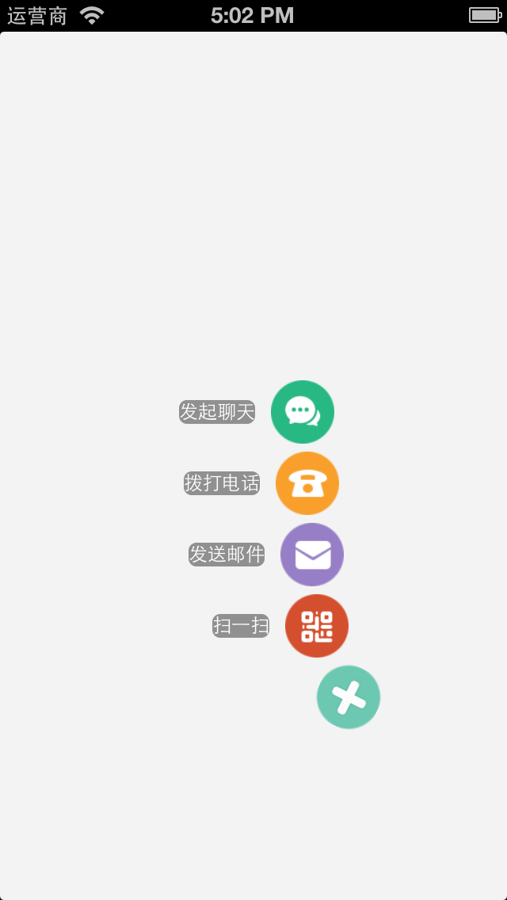

## Sector Menu （扇形动画菜单）
***

###  How to Use ?

####Step 1

make a THSectorMenu instance

for example:
<pre><code>
THSectorMenu *menu = [[THSectorMenu alloc] initWithFrame:CGRectMake(200, 400, 40, 40) backgroundImage:[UIImage imageNamed:@"menu.png"]];
</code></pre>

##### Step 2

make several sub menu item, and add to a NSArray object

for example:

<pre><code>
THOneMenuItem *subMenu1 = [[THOneMenuItem alloc] initWithTitle:@"发起聊天" image:[UIImage imageNamed:@"chat.png"]];
THOneMenuItem *subMenu2 = [[THOneMenuItem alloc] initWithTitle:@"拨打电话" image:[UIImage imageNamed:@"telephone.png"]];
    
NSArray *subMenus = [NSArray arrayWithObjects:subMenu1, subMenu2**, nil];
</code></pre>

#### Step 3

set items of THSectorMenu instance

<pre><code>
[menu setItems:subMenus];
</code></pre>

***

### Screenshot of this project

